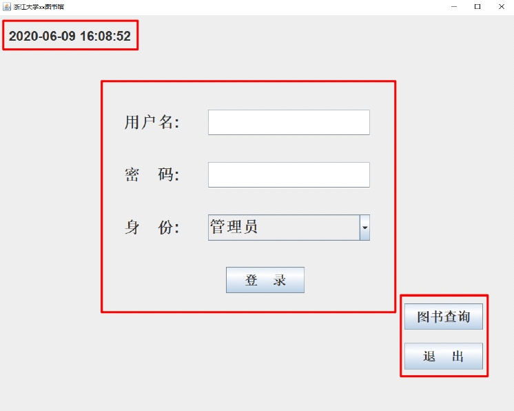
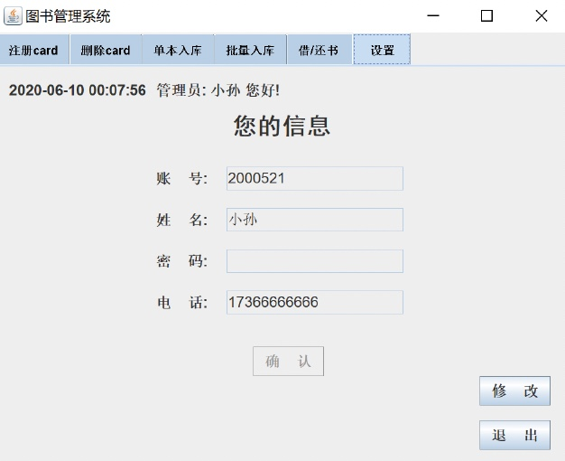
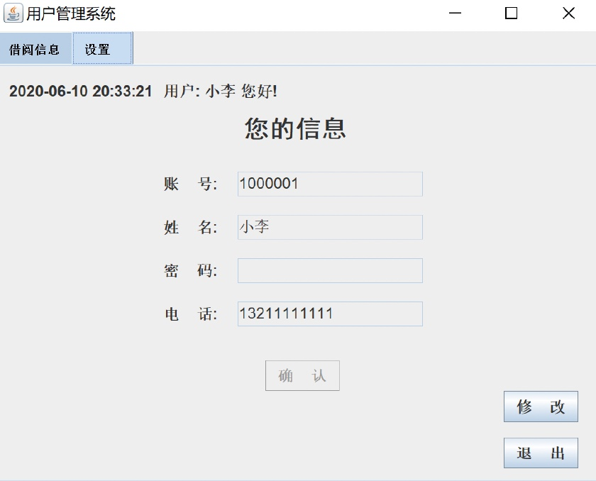

# Library-Management-System
Course Project of Principles of Database Systems of Zhejiang University.

## **Contents**
- [Introduction](#introduction)
- [Development Environment & Tools](#development-environment--tools)
- [System Design](#system-design)

<hr>

### **Introduction**
 This repo implements a simple library management system including front-end GUI and back-end database.

 ```
 code/src:
 .
├── base
│   ├── Book.java
│   ├── BorrowRecord.java
│   └── CalTime.java
├── connect
│   └── Dao.java
├── frame
│   ├── AdminFrame.java
│   ├── LibraryFrame.java
│   ├── LoginFrame.java
│   └── UserFrame.java
└── panel
    ├── AddBatchBook.java
    ├── AddBook.java
    ├── AddCard.java
    ├── BorrowBook.java
    ├── DeleteCard.java
    ├── MyTabbedPaneUI.java
    ├── MyTableModel.java
    ├── Setting.java
    └── UserBorrow.java
```

<hr>

### **Development Environment & Tools**
- Windows 10
- MySQL 5.7
- MySQL JDBC 5.1.49
- Java JDK 1.8.0_181
- Eclipse Java Oxygen

<hr>

### **System Design**


### **1. Login**
- Time Display
- User Login
- Jump to Other Interface



### **2. Administrator**
- Register ID
- Delete ID
- Add A Book
- Add A Batch of Books
- Borrow & Return Books
- Setting



### **3. Book Query**


### **4. User**
- Borrowing Information Query
- Setting



